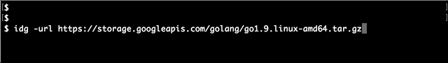

# idg
A simple tool that support you download file at very fast speed was implemented by Golang.

[](https://circleci.com/gh/canhlinh/idg)
[](http://godoc.org/github.com/github.com/canhlinh/idg)

### Run test
```
Make test
```

### Example
```
	file, err := idg.NewFile("https://storage.googleapis.com/golang/go1.9.linux-amd64.tar.gz")
	if err != nil {
		log.Fatal(err)
	}

	if err := file.StartDownload(); err != nil {
		log.Fatal(err)
	}
	time.Sleep(time.Second)
```
